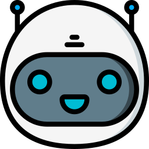
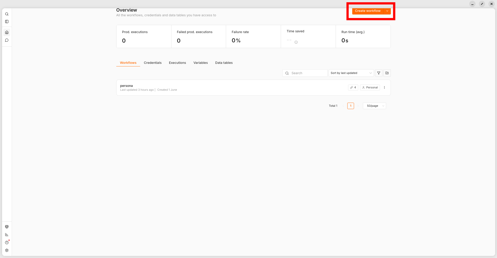
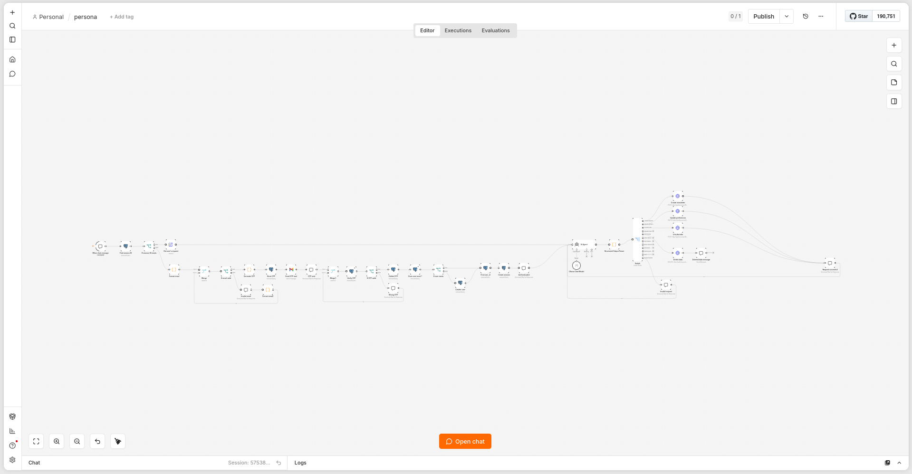
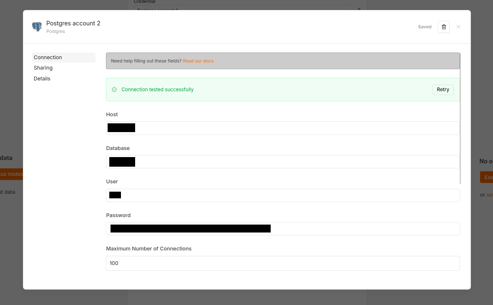
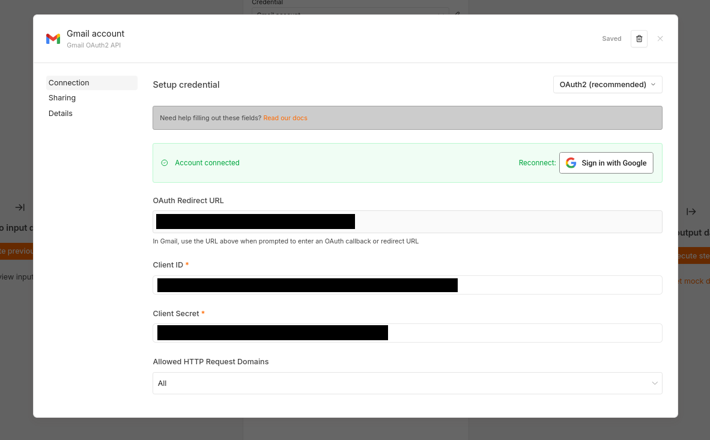

<div id="top">

<div align="center">



# <code> 101Bot </code>

AI-powered newsletter orchestration platform built with n8n, FastAPI, PostgreSQL, and Ollama.


tools and technologies used:


</div>

---

## Table of Contents

- [Table of Contents](#table-of-contents)
- [Overview](#overview)
- [Features](#features)
- [Project Structure](#project-structure)
- [Getting Started](#getting-started)
- [Roadmap](#roadmap)
- [Contributing](#contributing)
- [License](#license)
- [Acknowledgments](#acknowledgments)

---

## Overview

101Bot is a personalized newsletter assistant designed to automate content delivery from a single conversational entry point.
The platform combines an n8n workflow for orchestration, a FastAPI backend for the application routes, PostgreSQL for persistence, and Ollama for AI-assisted interactions.
It is centered on chat-based onboarding, email verification, session handling, and newsletter preference management.

---

## Features

- Chat-based onboarding and authentication flow
- Email verification with OTP generation and validation
- Persistent storage for users, sessions, and newsletter preferences
- FastAPI routes for newsletter and account management
- n8n workflow orchestration for end-to-end automation
- Ollama integration for AI-assisted processing

---

## Project Structure

```sh
└── 101Bot/
   ├── assets/
   │   ├── homepage.png
   │   ├── workflow.png
   │   └── credentialsPostgres.png
   ├── db/
   │   └── init.sql
   ├── docs/
   │   └── devusage.md
   ├── n8n_data/
   ├── ollama_data/
   ├── postgres_data/
   ├── src/
   │   ├── main.py
   │   ├── db/
   │   ├── newsletter/
   │   └── user/
   ├── workflow/
   │   └── persona.json
   ├── docker-compose.yml
   ├── run.sh
   ├── README.md
   └── READMEenhance.md
```

---

## Getting Started

### Prerequisites

This project requires the following dependencies:

- **Runtime:** Docker and Docker Compose v2
- **Programming Language:** Python
- **Application Stack:** n8n, FastAPI, PostgreSQL, Ollama
- **Git:** for cloning and version control

### Installation

Build the project from source and configure the environment:

1. **Clone the repository:**

```sh
git clone git@github.com:leolcde/101Bot.git
```

2. **Navigate to the project directory:**

```sh
cd 101Bot
```

3. **Create the environment file:** copy [`.env.example`](.env.example) to `.env` and fill in the database values.

```
POSTGRES_USER=user
POSTGRES_PASSWORD=password
POSTGRES_DB=database
POSTGRES_HOST=postgres
```

4. **Start the stack:**

```sh
./run.sh
```

### Usage

Once the stack is running, the main services are available at:

- **n8n:** http://localhost:5678
- **FastAPI service:** http://pythonscript:8000
- **Ollama:** http://ollama:11435

#### Import the workflow into n8n

1. Open n8n in your browser: http://localhost:5678
2. Create a n8n account if this is your first launch.
3. Create a new workflow from the dashboard.



4. Use the **Import from File** option and select [workflow/persona.json](workflow/persona.json).



5. Configure the credentials required by the workflow.

For PostgreSQL, use the values defined in your `.env` file.



If you want to check if your database is up check [Documentation Database](./docs/UseDB.md).

For Gmail, create a Google Cloud project, enable the Gmail API, and configure the OAuth credentials in n8n.

[EXPLAINER VIDEO FOR GCLOUD](https://www.youtube.com/watch?v=1Ua0Eplg75M)

In the Gmail credential node, configure the following values:

- OAuth Redirect URL: `http://localhost:5678/rest/oauth2-credential/callback`
- Client ID: from your Google Cloud application
- Client Secret: from your Google Cloud application



Once the credentials are configured, the workflow is ready to process newsletter requests end to end.

---

## Roadmap

- [X] Project management
- [X] Set up Docker, API, and database infrastructure
- [X] Implement the authentication system
- [X] Configure and integrate the AI model
- [ ] Develop the Python route handlers
- [ ] Build data scraping features based on user preferences
- [ ] Add bonus features such as LinkedIn posting, Discord newsletter delivery, and more
- [ ] Improve and finalize the documentation

---

## Contributing

Contributions are welcome. If you want to improve the project, check [contributing documentations](./docs/DevContributing.md).

---

## License

This project does not currently ship with a dedicated license file. If you plan to publish or distribute the code, add a license that matches your intended usage.

---

## Acknowledgments

- Credit `contributors: 8kao, leolcde`

[![][back-to-top]](#top)
</div>

[back-to-top]: https://img.shields.io/badge/-BACK_TO_TOP-151515?style=flat-square

---
