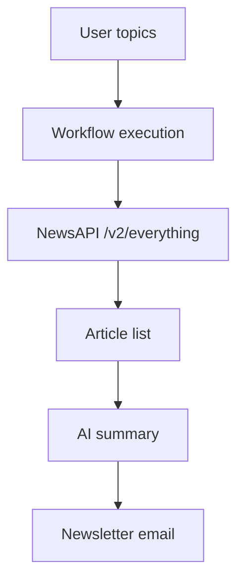

# NewsAPI Usage and Pricing

This document describes how 101Bot uses NewsAPI, how request volume maps to cost, and how to estimate monthly spend by user count.

## How It Is Used In 101Bot

The workflow queries NewsAPI from the `Search news by subject` node in [workflow/persona.json](../workflow/persona.json).
The request goes to `https://newsapi.org/v2/everything` with the following parameters:

| Parameter | Value | Purpose |
| --- | --- | --- |
| `q` | topics joined with `OR` | Searches articles matching any selected topic |
| `language` | `en` | Limits results to English articles |
| `pageSize` | `10` | Caps the number of returned articles |
| `sortBy` | `publishedAt` | Prefers the newest articles first |
| `apiKey` | current workflow secret | Authenticates the request |

After NewsAPI returns articles, the workflow simplifies the payload, then asks the AI summarizer to build the newsletter email.

## Important Billing Note

NewsAPI does not bill on tokens.
It bills on requests.

That means the cost depends on how many times the workflow calls NewsAPI, not on how long the prompt or article text is.

Token usage still matters for the LLM step used to summarize the articles, but that is a separate cost model.

## Business Plan Pricing

| Item | Value |
| --- | --- |
| Monthly price | $449 |
| Billing | Monthly |
| Included requests | 250,000 requests / month |
| Extra request price | $0.0018 per request |
| SLA | No uptime SLA |
| Support | Email support |

## Market Comparison

The table below is an illustrative market-style comparison of common news APIs.
It is meant for documentation and product positioning, not as a procurement benchmark.

| API | Pricing posture | Coverage posture | Ease of integration | Best fit | Notes |
| --- | --- | --- | --- | --- | --- |
| NewsAPI | Mid-to-premium | Broad general news | Very easy | Fast prototypes and aggregated news feeds | Good default when you want a simple query API |
| GNews | Low-to-mid | Broad general news | Easy | Lightweight apps and budget-conscious projects | Often used when cost simplicity matters |
| The Guardian API | Low | Editorial and publisher-specific | Easy | Newsrooms and content-aware products | Strong for publisher-grade content, narrower scope |
| New York Times API | Mid | Premium publisher content | Moderate | Editorial products and trusted sources | Good quality, but less generic than aggregated APIs |
| Bing News Search API | Mid-to-premium | Broad web and news search | Moderate | Search-heavy experiences | Useful when discovery matters more than curation |

### Quick Positioning Summary

| Dimension | NewsAPI | Market interpretation |
| --- | --- | --- |
| Breadth | High | Strong choice for general-purpose aggregation |
| Integration speed | High | Easy to drop into an automation workflow |
| Pricing clarity | High | Simple request-based model |
| Editorial depth | Medium | Less publisher-specific than single-source APIs |
| Scalability for newsletters | High | Fits automated newsletter generation well |

### Simplified Scorecard

Scores are illustrative from 1 to 5.

| API | Breadth | Price simplicity | Integration speed | Editorial depth | Overall fit for 101Bot |
| --- | --- | --- | --- | --- | --- |
| NewsAPI | 5 | 4 | 5 | 3 | 5 |
| GNews | 4 | 5 | 4 | 2 | 4 |
| The Guardian API | 3 | 4 | 4 | 5 | 3 |
| New York Times API | 3 | 3 | 3 | 5 | 3 |
| Bing News Search API | 4 | 3 | 3 | 3 | 4 |

## Cost Formula

Let `R` be the total number of monthly NewsAPI requests.

```text
monthly_cost = 449 + max(0, R - 250000) * 0.0018
```

If `R <= 250000`, the bill stays at $449.
If `R > 250000`, each extra request adds $0.0018.

## Visual Flow



## Cost Scenarios By User Count

Assumption used for the table below:

- 1 user generates 1 newsletter per day
- 1 newsletter triggers 1 NewsAPI request
- 1 month = 30 requests per user

| Users | Requests / user / month | Total requests / month | Requests over quota | Estimated monthly cost |
| --- | --- | --- | --- | --- |
| 1 | 30 | 30 | 0 | $449.00 |
| 10 | 30 | 300 | 0 | $449.00 |
| 100 | 30 | 3,000 | 0 | $449.00 |
| 1,000 | 30 | 30,000 | 0 | $449.00 |
| 10,000 | 30 | 300,000 | 50,000 | $539.00 |
| 50,000 | 30 | 1,500,000 | 1,250,000 | $2,699.00 |

## Comparison Table

| Deployment size | Request volume | Quota status | Overage cost | Notes |
| --- | --- | --- | --- | --- |
| Small | Very low | Inside quota | None | Safe margin on the included plan |
| Medium | Moderate | Inside quota | None | The plan still covers the usage |
| Large | High | Exceeds quota | Yes | Overages begin after 250,000 requests |
| Very large | Very high | Exceeds quota | Yes | Cost scales linearly with extra requests |

## Practical Recommendations

1. Keep `pageSize` low unless the newsletter needs more raw material.
2. Cache repeated searches when multiple users share the same topic set.
3. Move the API key out of the workflow export and into a secret manager or environment variable.
4. Track request count per day so you can predict when you approach the quota.

## Quick Formula For Product Planning

If you want a fast estimate, use this model:

```text
monthly_requests = users * newsletters_per_user_per_month * newsapi_requests_per_newsletter
monthly_cost = 449 + max(0, monthly_requests - 250000) * 0.0018
```

Example:

```text
5000 users * 30 newsletters * 1 request = 150000 requests
monthly_cost = 449
```

```text
10000 users * 30 newsletters * 1 request = 300000 requests
monthly_cost = 449 + (300000 - 250000) * 0.0018 = 539
```
